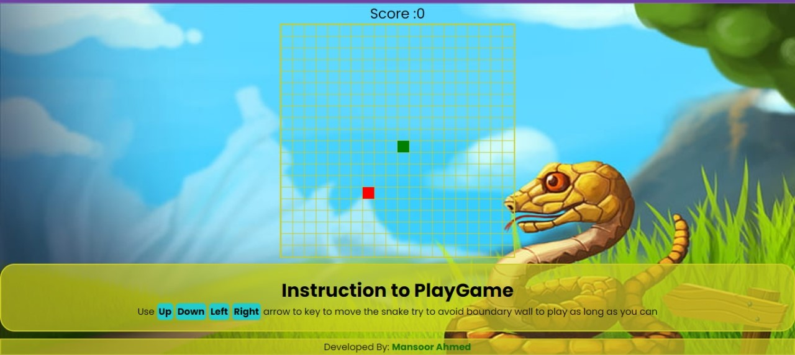
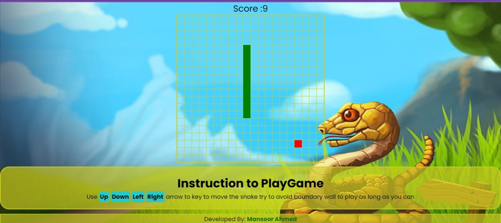
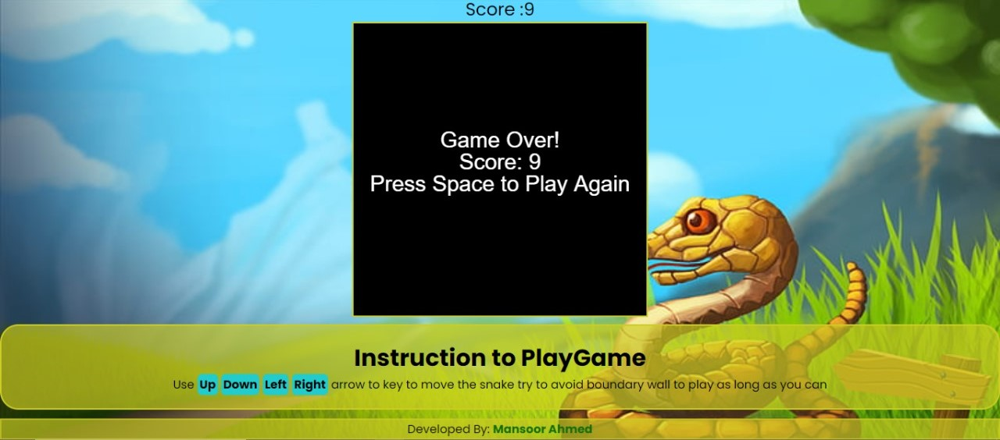

# snakeGame

A simple Snake Game created using HTML, CSS, and JavaScript.

## Screenshots

Here are a few screenshots of the game:
1. Play Game

2. Eating Food

3. Game Over!

## How to Play

### Objective
The objective of the Snake Game is to eat food (the red square) that randomly appears on the board. Each time the snake eats food, its length increases. The game is over when the snake runs into a wall or itself.

### Controls
- Use the arrow keys (Up, Down, Left, Right) to control the direction of the snake.
- To restart the game after it's over, press the "Space" key.

## Play the Game Here

[PlayGame](https://harmonious-piroshki-cb26e2.netlify.app)

## Maintainers
### Mansoor Ahmed

- GitHub: [Mansoor Ahmed](https://github.com/MansoorAhmedk)

